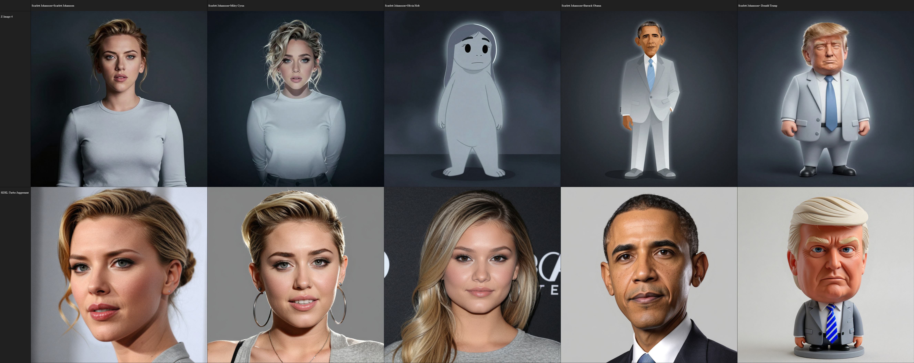
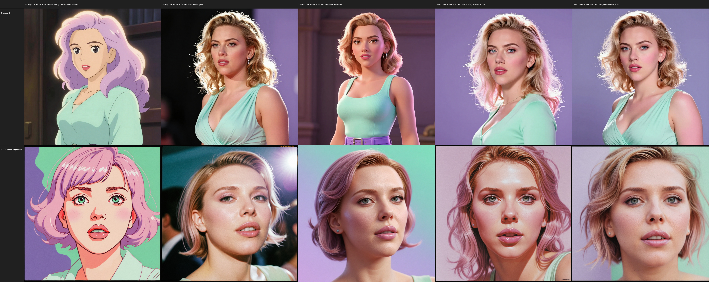

# Comparison Tables
## Contribution Guidelines
1. All contributions must be SFW. (Absolutely no nudity.)
2. Comparisons must consist of at least 5 variables and at least 2 models.
3. Comparisons must be generated in SwarmUI grid generator with no other variables. eg: style comparisons must only compare style prompt.
4. Comparison thumbnails must be 1:1 images, .jpg, grid generation output.
5. Comparisons must be submitted using the following template:

| Model | Score | VAR #1 | VAR #2 | VAR #3 | VAR #4 | VAR #5 |
|:-|:-:|:-:|:-:|:-:|:-:|:-:|
| Model #1 | 4 | Y | Y| N | Y | Y |
| Model #2 | 5 | Y | Y | Y | Y | Y |

## Comparison Tables
### Celeb
| Model | Score | Celeb #1 | Celeb #2 | Celeb #3 | Celeb #4 | Celeb #5 |
|:-|:-:|:-:|:-:|:-:|:-:|:-:|
| Z-Image | 4 | Y | Y | N | Y | Y |
| Juggernaught XI | 5 | Y | Y | Y | Y | Y |

### Style
| Model | Score | studio ghibli anime illustration | candid raw photo | in-game 3d render | artwork by Larry Elmore | impressionist artwork |
|:-|:-:|:-:|:-:|:-:|:-:|:-:|
| Z-Image | 3 | Y | Y | Y | N | N |
| Juggernaught XI | 3 | N | Y | Y | Y | N |

