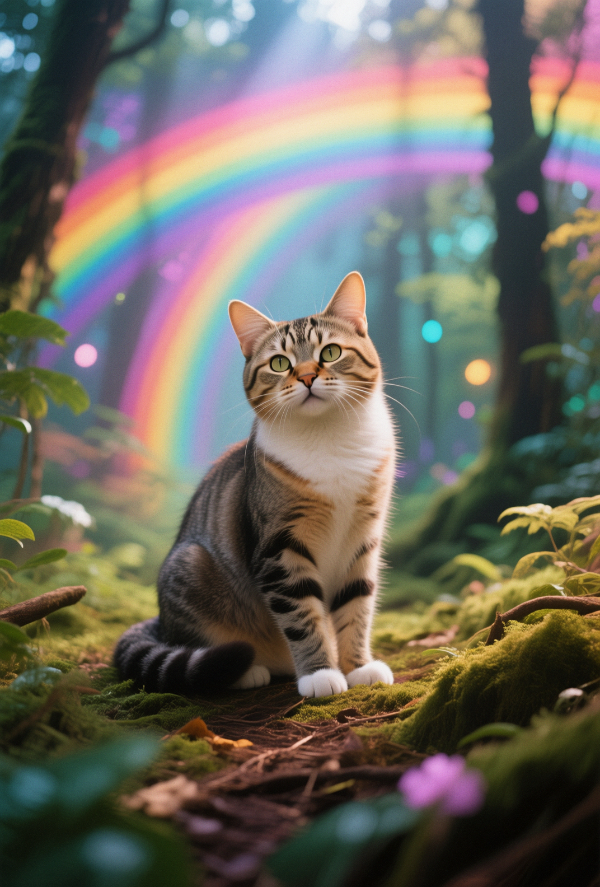

# Qwen
**What is Qwen?**
Qwen is a Large-Language Model (LLM), and now it is also a collection of image models. We're going to be exploring **Qwen-Image** and **Qwen-Edit**, and comparing them to their peers.


`a cat in a magical rainbow forest`
`generation_time: 3.66 min`
**Preset:** Download SwarmUI preset file for these parameters here: 

## Qwen-Image
**Qwen-Image** is an image generation model, much like Flux, Wan and Stable-Diffusion. What makes Qwen-Image special is that it uses it's own LLM, Qwen7B, as a text-encoder. So, instead of just being a library of tags or tokens, it's a full-fledged 7B *AI* model functioning as the middle man between your prompt and the image generation model.

This enables it to have a much greater *understanding* of the user's prompt which produces images that demonstrate a much greater **prompt adherence** than other image generation models. This is however, not without cost. As they say, "With great power comes great VRAM usage.". Fortunately, there are solutions to the challenges we face in using this model. They are a. Quantization, and b. Lightning-LoRa. I won't get into what they are and how they work exactly, but you can think of **quantization** like rounding numbers with lots of decimal places. You can represent a similar value using much less time/space with rounding, resulting in a much smaller file-size. Which, in-turn means less memory usage. **Lightning** on the other hand is a technique that results in allowing users to be able to generate comparable resultant images in fewer iterations (4 steps vs 20), and most importantly removing the need for and functionality of the parameter called CFG. When you generate an image with CFG: 1 it will take half as long as it would to generate the same image with a value > 1. Most models can't function like this and this is where the **Lightning-LoRa** comes into play.

The **Lightning-LoRa** solution is very similar to that of the **DMD2-LoRa** many SDXL users may be familiar with and is developed in a similar fashion to a distillation such as Flux.Schnell and Qwen-Image-Distilled.

### Qwen-Image/Distill vs Quantization vs Lightning-LoRa
Which one should you use? While Qwen-Distill is decent & fast on it's own, Qwen-Image+Lightning-LoRa is much faster.
| Model | fp8 | q4_km.gguf | distill  |
|:-:|:-:|:-:|:-:|
| Steps | 20 | 20 | 10 |
| CFG | 2.5 | 2.5 | 1 |
| Gen. Time | 2.69 min | 3.17 min | 85.69 sec |
| Image |  |  |  |

On it's own, Qwen-Distilled is the clear winner here. However, the introduction of the **Lightning-LoRa** changes things.

| Model | fp8 | q4_km.gguf | distill  |
|:-:|:-:|:-:|:-:|
| Steps | 4 | 4 | 4 |
| CFG | 1 | 1 | 1 |
| Gen. Time | 32.38 sec | 26.08 sec | 64.80 sec |
| Image |  |  |  |

| Model | fp8 | q4_km.gguf | distill  |
|:-:|:-:|:-:|:-:|
| Steps | 8 | 8 | 8 |
| CFG | 1 | 1 | 1 |
| Gen. Time | 49.02 sec | 83.36 sec | 64.80 sec |
| Image |  |  |  |

`LoRa used: Qwen-Image-Lightning-4steps-V1.0`


All of a sudden generaiton times are flipped on their head! The largest model, fp8 has the fastest generation time!

**Use these parameters in SwarmUI to replicate this experiment.**

```
Prompt: a cat in a magical rainbow forest
Model: Qwen/qwen_image_fp8_e4m3fn
Seed: 826777395
Steps: 8
CFG Scale: 1
Side Length: 1328
Sampler: Euler
Scheduler: Simple
Sigma Shift: 3.1
LoRAs: Qwen/Qwen-Image-Lightning-4steps-V1.0 : 1
generation_time: 49.02 sec
Swarm Version: 0.9.6.5
```