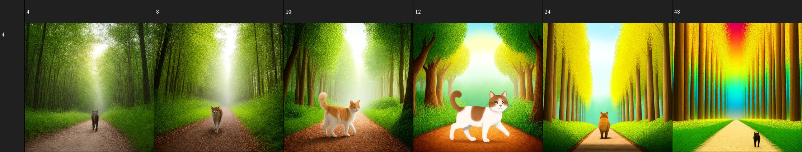
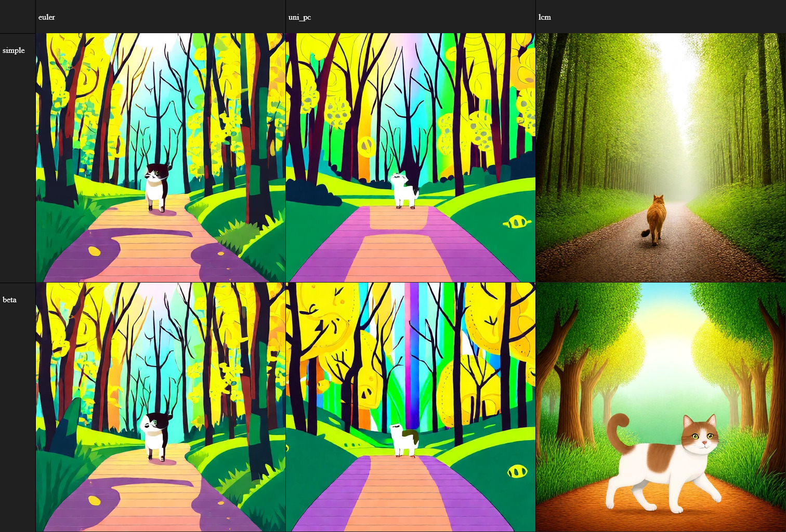
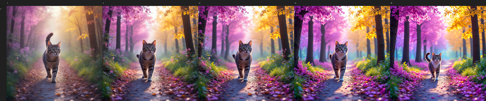
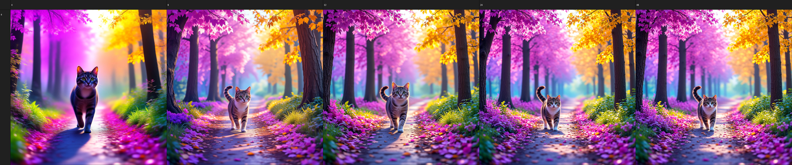
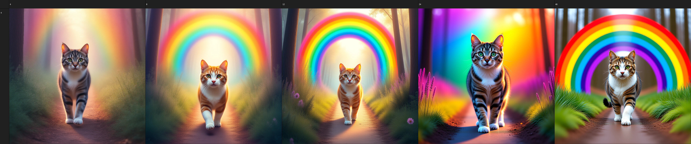
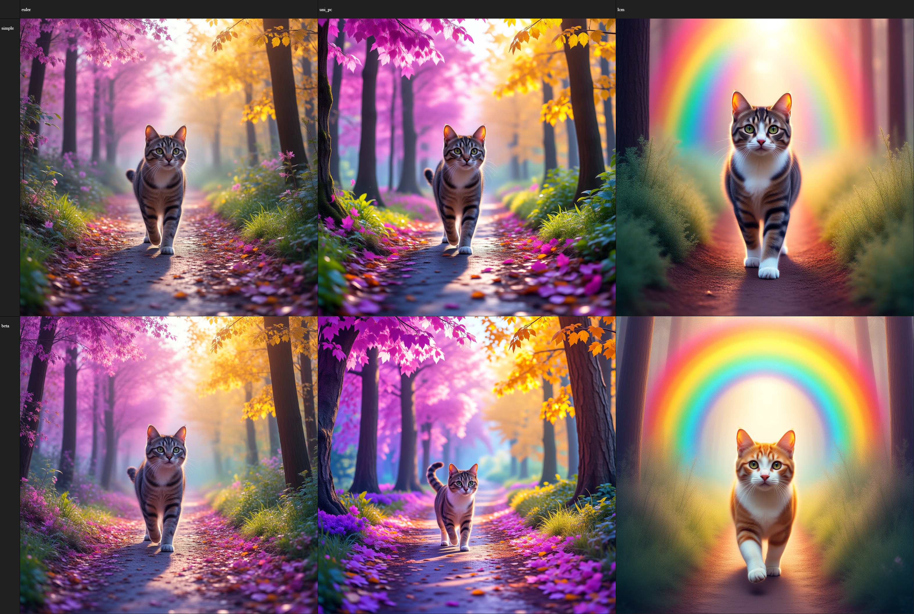
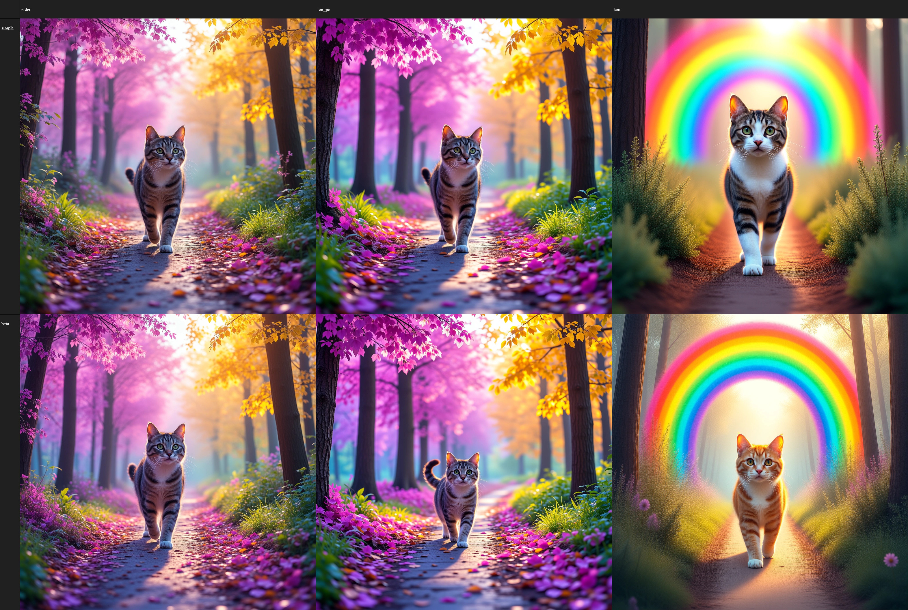
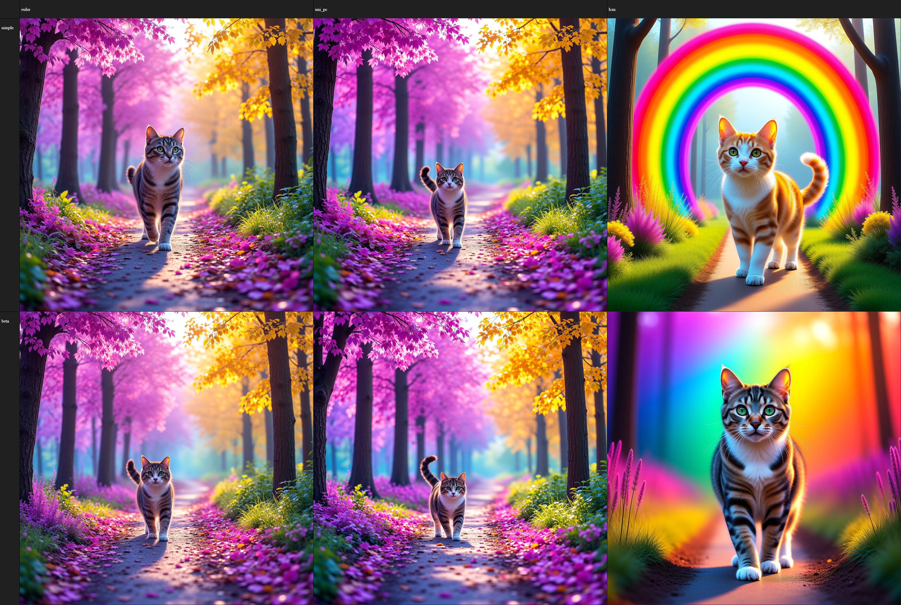
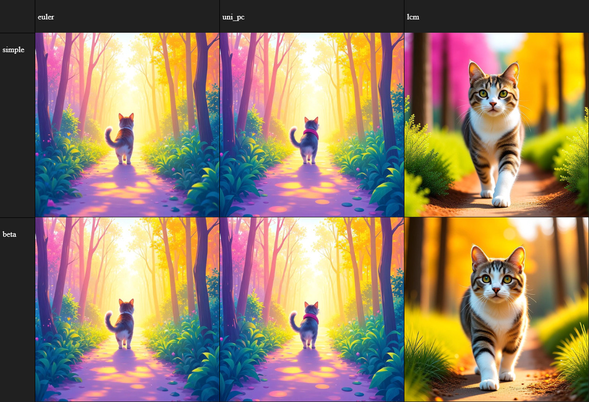

# Wan Still Image Generation
**Wan2.1** is a fully functional, and very impressive single-frame/still-image generation model. It is comparable to Flux.Dev in output quality. In these comparisons we are studying **Wan2.1:1.3b** & **Wan2.1:14b**. 

**Software used:** `SwarmUI`

**Prompt:** `a cat walking in a magical rainbow forest`

**Steps:** `Variable: 4, 8, 10, 12, 24, 48`

**Samplers:** `Euler, UniPC, LCM`

**Schedulers:** `Simple, Beta`

**LORA:** `1.3b: DMD-FP16; 14b: FusionX, LightX2V`

| Wan2.1:1.3b | Wan2.1:14b |
|:-:|:-:|
|||
| 12 Steps, LCM/BETA | 24 Steps, LCM/BETA |

# 1.3b
Model: `Wan2_1-T2V-1_3B_bf16`

LORA: `Wan2.1-T2V-1.3B-Self-Forcing-DMD-FP16-LoRA-Rank32`
## Step-count
|4 Steps|8 Steps|10 Steps|12 Steps|24 Steps|48 Steps|
|:-:|:-:|:-:|:-:|:-:|:-:|

LCM/BETA chosen for this comparison.

## Sampler/Scheduler

12 Steps chosen for this comparison.

## Conclusion
With **WAN2.1-1.3b**, LCM/BETA should be used with 12-steps + Wan2.1-T2V-1.3B-Self-Forcing-DMD-FP16-LoRA-Rank32 @ 480x480

# 14b
Model
- Wan2.1-t2v-14b-Q4_K_M.gguf

LORA
- Wan2.1_T2V_14B_FusionX_LoRA
- Lightx2v_cfg_step_distill_lora_rank32
## Step-Count
4, 8, 12, 24, 48 Steps
### Euler/Beta
|4 Steps|8 Steps|12 Steps|24 Steps|48 Steps|
|:-:|:-:|:-:|:-:|:-:|

### UniPC/Beta
|4 Steps|8 Steps|12 Steps|24 Steps|48 Steps|
|:-:|:-:|:-:|:-:|:-:|

### LCM/Beta
|4 Steps|8 Steps|12 Steps|24 Steps|48 Steps|
|:-:|:-:|:-:|:-:|:-:|

## Sampler/Scheduler
### 8-Steps

### 12-Steps

### 24-Steps

### 48-Steps

## LORA Comparison
**Since** Wan2.1-14b has multiple valid LORA combinations, they are tested and evaluated below. The evaluation includes.
- LightX2v
- FusionX
### Euler/Simple

### LCM/Beta

### UniPC/Beta

# Prompt Adherence
**The prompt** used in these generations is...

    Leon Kennedy wearing a red suit. He is smiling and carrying a shotgun. Jill Valentine is wearing a blue bikini and a blue beret. She is sitting on a toilet holding a banana. Claire Redfield is wearing a yellow dress and she is making a snowman out of sand. There is a Star Destroyer in the background.
## 1.3b
## 14b
### Euler/Simple

### UniPC/Beta

### LCM/Beta

## Conclusion
With **WAN2.1-14b**, Any (Euler/Simple, UniPC/BETA, LCM/BETA) should be used with...
- FusionX @ 12-24 Steps
- LightX2V @ 12-24 Steps
- FusionX + LightX2V @ 4-8 Steps
- FusionX(0.6) + LightX2V @ 4-8 Steps