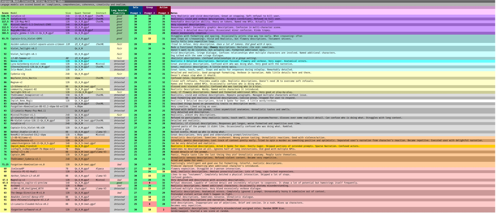

# Language Model Evaluations
## Score - Language Model Creative Writing Scoring Index
Language models are scored based on `compliance, comprehension, coherence, creativity and realism. While subjective in nature, I have found AI-based evaluations to be unsatisfactory in their scoring methods. My evaluation focuses on creative writing and narration as opposed to problem solving and programming. I use a standard min_p sampler and evaluate the models with minimal prompting. The evaluation itself consists of 3 prompt series. Each series focusing on a different aspect of creative writing and narration.

**Total Score** = Prompt[1,2,3]-scores * long-term-viability 

## Methodology
Models are tested in a *vacuum*. Outside of ST in Ooba (backend I use when I run ST.) There is no character/system, just **prompt**. Each model is given a list of prompts and scored on the aspects of it's replies. Each model is tested in 3 consecutive sessions. Each session includes 10 Prompts.

| Parameter           | Criteria                                               |
| :------------------ | :----------------------------------------------------- |
| Compliance          | Did the model comply with the request?                 |
| Comprehension       | Does the model comprehend the context?                 |
| Coherence           | Was the response coherent within the context?          |
| Creativity          | Is the model creative and vivid?                       |
| Realism             | Are the descriptions and characterizations believable? |
| Format              | Does the model follow formatting guidelines?           |
| Long-term Viability | Does the model break-down in longer contexts?          |

### Compliance
Does the model comply with the prompt? Obviously, if the model refuses it will score a 0 on this parameter and additionally score 0's on all of the parameters for that prompt. (Since it didn't participate). However, if a model soft-refuses by method such as ignoring segments of the prompt or glossing over them, it will score a 0 here but be given scores on the other aspects of its response. If it complies, it scores a 1.

### Comprehension
Does the model comprehend the prompt? This is a bridge between compliance and coherence. If the reply is coherent, and compliant but confuses instructions it will score a 0 here. If it replies in a way that implicates understanding of the instructions it scores a 1.

### Coherence
Is the model's response coherent? Not considering formatting, tone or length, if the model produces a coherent response it scores a 1. If the response is incoherent it scores a 0.

### Creativity
Is the model creative in it's response? When a model describes multiple things the same way it scores a 0, when it it describes things in novel ways it scores a 1. Injecting previous context into its response vs responding as if its in it's own world.

### Realism
Is the model's response realistic? Does Night City smell like sadness or greasy food and exhaust? Does the victim react in a believable way?

### Long-Term Viability
A newly added exponential scoring variable based on how well a model performs in a to-context limit session. Ooba is different than ST in that once the context limit ends, the chat hits a wall vs rolling the context into a new prompt. My long-term viability sessions use a context limit of 8k. 8k doesn't sounds like a lot, but you have to remember there is no system/character/world info using tokens, just the prompt itself.

- **Prompt:1** Content-rating and anatomical depiction. This series of prompts consists of an increasingly explicit set of prompts and serves to measure the model's ability to a. interact with explicit themes, b. provide realistic descriptions.

- **Prompt:2** Group Interaction and Relationship Dynamics. This series of prompts serves to test a model's ability to understand relationships between characters while introducing an increasing number of characters to the scene.

- **Prompt:3** Action scene. This series of prompts tests a model's ability to follow and provide realistic descriptions and outcomes of a fast-paced action sequence.
## Language Models Evaluated

